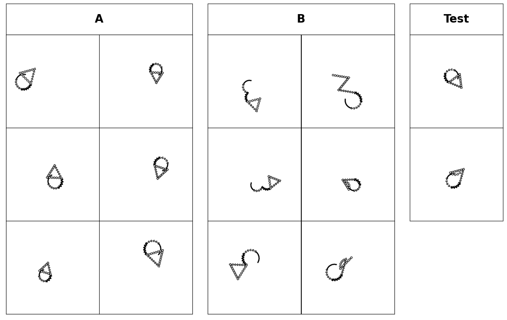
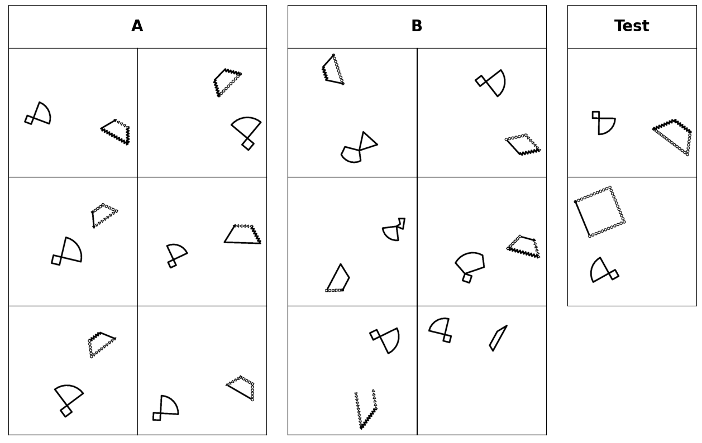
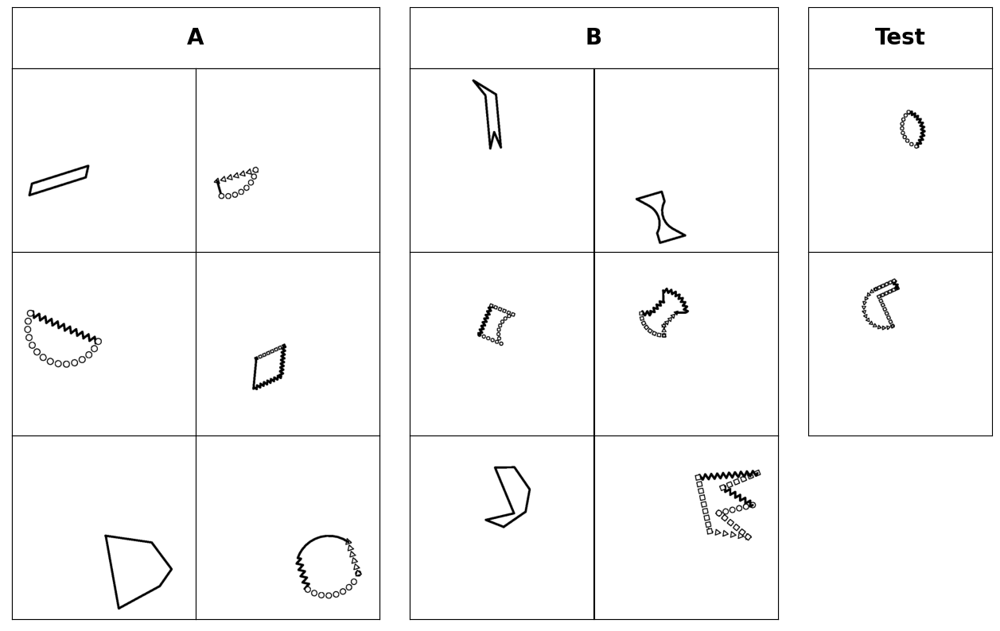

# Bongard-LOGO

## [Update on 03/20/2021]: The code for training Bongard LOGO baselines was released [here](Bongard-LOGO_Baselines).


## Introduction

`Bongard-LOGO` is a Python code repository with the purpose of generating synthetic [Bongard problems](https://en.wikipedia.org/wiki/Bongard_problem) on a large scale with little human intervention. It mainly consists of a `Bongard-LOGO` dataset that has 12,000 synthetic Bongard problems, and a `bongard` Python library that is used for the synthesis of the Bongard problems. The user could use the `Bongard-LOGO` dataset for concept learning and symbolic learning, or use the `bongard` library for custom Bongard problem synthesis.

## The `Bongard-LOGO` Dataset

The `Bongard-LOGO` dataset contains 12,000 Bongard problems solely based on the `shape concept`, by considering as nuisances shape positions, orientations and sizes, etc. It is divided into three types of problems: 3,600 `Freeform Shape Problem`s, 4,000 `Basic Shape Problem`s and 4,400 `Abstract Shape Problem`s.

Furthermore, each image is paired with an action program, with which we can recover the shape(s) in the image, by using the provided rendering method.

Below are examples of each type of `Bongard-LOGO` problems.

Freeform Shape Problem          |  Basic Shape Problem            |  Abstract Shape Problem
:-------------------------:|:-------------------------:  |:-------------------------:
  |  | 

The `Bongard-LOGO` dataset could be directly downloaded from [Google Drive](https://drive.google.com/file/d/1-1j7EBriRpxI-xIVqE6UEXt-SzoWvwLx/view?usp=sharing).

For more details of how to generate the `Bongard-LOGO` dataset, please refer to the [Bongard-LOGO](examples/02-bongard_logo) example.

## The `bongard` Python Library

### Installation

#### Using Docker Container

It is strongly recommended to use Docker container. The Docker container has the `bongard` library installed and the user does not have to install it manually.

To build the Docker image, please run the following command in the terminal.

```bash
docker build -f docker/bongard.Dockerfile --tag=bongard:0.0.1 .
```

To run the Docker container, please run the following command in the terminal.

```bash
docker run -it --rm bongard:0.0.1
```

#### Installation From Source

To install the `bongard` library from the latest source code, please run the following command in the terminal.

```bash
git clone https://github.com/NVlabs/Bongard-LOGO.git
cd Bongard-LOGO
pip install .
```

#### Installation From PyPI

To install the `bongard` library from the published packages on [PyPI](https://pypi.org/), please run the following command in the terminal.

```bash
pip install bongard
```

### Usages

The Bongard library consists of four typical classes, `BongardProblem`, `BongardImage`, `OneStrokeShape`, and `BasicAction`. There exists a hierarchy for the four classes.

Each `BongardProblem` consists of several positive `BongardImage`s that represents a certain concept and several negative `BongardImage`s that violates the concept in the positive images.

Each positive or negative `BongardImage` consists of several `OneStrokeShape`s. Each `OneStrokeShape` consists of several consecutive `BasicAction`s which are performed by a Python [turtle](https://docs.python.org/3/library/turtle.html). 

In short, the data structure hierarchy is `BongardProblem` -> `BongardImage` -> `OneStrokeShape` -> `BasicAction`.

Note that `BongardImage` is not really an image, but a schema for the painter to create image. This also applies to the above other classes.

#### `BasicAction`

The `BasicAction` is performed by a Python [turtle](https://docs.python.org/3/library/turtle.html). 
There are two types of `BasicAction`s that have been implemented, `LineAction` and `ArcAction`. `LineAction` is moving following a line with optionally some features in the trajectory, such as zigzag and stamps, followed by an optional change in the moving directions. 
Similarly, `ArcAction` is moving following an arc with optionally some features in the trajectory, such as zigzag and stamps, followed by an optional change in the moving directions.

```python
from bongard import LineAction, ArcAction
# Create an instance of LineAction
# line_length: a float number between 0 and 1.0.
# line_type: a string indicating the type of lines. Currently, the BongardPainter supported "normal", "zigzag", "square", "arrow", "circle", "square", "triangle", and "classic".
# turn_direction: a string indicating turning left or right after moving. It has to be "L" or "R". "L" for left and "R" for right.
# turn_angle: a float number between 0 and 180.0.
line_action = LineAction(line_length=0.5, line_type="normal", turn_direction="R", turn_angle=90)
# Create an instance of ArcAction
# arc_angle: a float number between -360 and 360.
# arc_radius: a float number between 0 and 1.0.
# arc_type: a string indicating the type of lines. Currently, the BongardPainter have supported "normal", "zigzag", "square", "arrow", "circle", "square", "triangle", and "classic".
# turn_direction: a string indicating turning left or right after moving. It has to be "L" or "R". "L" for left and "R" for right.
# turn_angle: a float number between 0 and 180.0.
arc_action = ArcAction(arc_angle=90, arc_type=n"zigzag", turn_direction="R", turn_angle=0, arc_radius=0.5)
```

#### `OneStrokeShape`

The `OneStrokeShape` could be created using a sequence of `BasicAction`s.

```python
from bongard import LineAction, OneStrokeShape

# Create a rectangle
def create_rectangle(w, h):

    action_0 = LineAction(line_length=w, line_type="normal", turn_direction="R", turn_angle=90)
    action_1 = LineAction(line_length=h, line_type="normal", turn_direction="R", turn_angle=90)
    action_2 = LineAction(line_length=w, line_type="normal", turn_direction="R", turn_angle=90)
    action_3 = LineAction(line_length=h, line_type="normal", turn_direction="R", turn_angle=90)

    rectangle_actions = [action_0, action_1, action_2, action_3]

    # basic_actions: a list of consecutive `BasicAction`.
    # start_coordinates: (float, float). The start coordinates on the canvas for the turtle. This would be set later when we start to generate images.
    # start_orientation: a float number between 0 and 360.0. The start orientation on the canvas for the turtle. This would be set later when we start to generate images.
    rectangle = OneStrokeShape(basic_actions=rectangle_actions, start_coordinates=None, start_orientation=None)

    return rectangle

rectangle = create_rectangle(w=0.5, h=0.3)
```

#### `BongardImage`

The `BongardImage` could be created using a list of `OneStrokeShape`s.

```python
from bongard import OneStrokeShape, BongardImage

# Create an image that consists of two rectangles
def create_random_rectangle_image():

    shapes = []

    for _ in range(2):
        w = np.random.uniform(low=0.3, high=1.0)
        h = np.random.uniform(low=0.3, high=1.0)
        shapes.append(create_rectangle(w=w, h=h))

    # one_stroke_shapes: a list of `OneStrokeShape`s
    bongard_image = BongardImage(one_stroke_shapes=shapes)

    return bongard_image

rectangle_image = create_random_rectangle_image()
```

#### `BongardProblem`

The `BongardImage` could be created using a list of positive `BongardImage`s and a list of negative `BongardImage`s.

```python
# Create an Bongard problem that has rectangle images as positive images and circle images are negative images.
from bongard import BongardImage, BongardProblem

bongard_problem_positive_images = [create_random_rectangle_image() for _ in range(7)]
bongard_problem_negative_images = [create_random_circle_image() for _ in range(7)]

# positive_bongard_images: a list of `BongardImage`s
# negative_bongard_images: a list of `BongardImage`s
# problem_name: string.
# problem_description: string.
# positive_rules: string.
# negative_rules: string.
bongard_problem = BongardProblem(positive_bongard_images=bongard_problem_positive_images
                                negative_bongard_images=bongard_problem_negative_images,
                                problem_name=None, problem_description=None, 
                                positive_rules=None, negative_rules=None)
```

We could also extract normalized action program from `BongardProblem` or create `BongardProblem` from normalized action program.

```python
# Extract action program
action_program = bongard_problem.get_action_string_list()
# Create `BongardProblem` from action program
bongard_problem_recovered = BongardProblem.import_from_action_string_list(action_string_list=action_program)
```

A typical action program for `BongardProblem` is like this. The actions from the positive images comes first followed by the actions from the negative images.

```python
[[[['line_triangle_0.715-0.250', 'line_triangle_0.891-0.250', 'line_triangle_0.715-0.250', 'line_zigzag_0.891-0.250']], [['line_circle_0.752-0.250', 'line_normal_0.606-0.250', 'line_normal_0.752-0.250', 'line_normal_0.606-0.250'], ['line_triangle_0.568-0.250', 'line_circle_0.854-0.250', 'line_normal_0.568-0.250', 'line_zigzag_0.854-0.250']], [['line_normal_0.885-0.250', 'line_triangle_0.536-0.250', 'line_normal_0.885-0.250', 'line_triangle_0.536-0.250'], ['line_normal_0.970-0.250', 'line_circle_0.398-0.250', 'line_triangle_0.970-0.250', 'line_normal_0.398-0.250']], [['line_circle_0.623-0.250', 'line_triangle_0.846-0.250', 'line_normal_0.623-0.250', 'line_zigzag_0.846-0.250'], ['line_triangle_0.400-0.250', 'line_circle_0.961-0.250', 'line_normal_0.400-0.250', 'line_triangle_0.961-0.250']], [['line_normal_0.430-0.250', 'line_circle_0.816-0.250', 'line_normal_0.430-0.250', 'line_normal_0.816-0.250'], ['line_normal_0.527-0.250', 'line_normal_0.405-0.250', 'line_zigzag_0.527-0.250', 'line_triangle_0.405-0.250']], [['line_normal_0.777-0.250', 'line_zigzag_0.552-0.250', 'line_zigzag_0.777-0.250', 'line_triangle_0.552-0.250']], [['line_triangle_0.979-0.250', 'line_circle_0.757-0.250', 'line_circle_0.979-0.250', 'line_triangle_0.757-0.250'], ['line_normal_0.825-0.250', 'line_zigzag_0.725-0.250', 'line_circle_0.825-0.250', 'line_normal_0.725-0.250']]], [[['arc_normal_0.497_0.625-0.500', 'arc_triangle_0.497_0.625-0.500', 'arc_triangle_0.497_0.625-0.500', 'arc_normal_0.497_0.625-0.500'], ['arc_normal_0.248_0.625-0.500', 'arc_normal_0.248_0.625-0.500', 'arc_normal_0.248_0.625-0.500', 'arc_circle_0.248_0.625-0.500']], [['arc_circle_0.342_0.625-0.500', 'arc_triangle_0.342_0.625-0.500', 'arc_triangle_0.342_0.625-0.500', 'arc_zigzag_0.342_0.625-0.500'], ['arc_normal_0.402_0.625-0.500', 'arc_zigzag_0.402_0.625-0.500', 'arc_zigzag_0.402_0.625-0.500', 'arc_zigzag_0.402_0.625-0.500']], [['arc_zigzag_0.311_0.625-0.500', 'arc_circle_0.311_0.625-0.500', 'arc_normal_0.311_0.625-0.500', 'arc_zigzag_0.311_0.625-0.500'], ['arc_circle_0.451_0.625-0.500', 'arc_normal_0.451_0.625-0.500', 'arc_zigzag_0.451_0.625-0.500', 'arc_triangle_0.451_0.625-0.500']], [['arc_normal_0.353_0.625-0.500', 'arc_triangle_0.353_0.625-0.500', 'arc_zigzag_0.353_0.625-0.500', 'arc_zigzag_0.353_0.625-0.500']], [['arc_circle_0.212_0.625-0.500', 'arc_triangle_0.212_0.625-0.500', 'arc_circle_0.212_0.625-0.500', 'arc_triangle_0.212_0.625-0.500'], ['arc_circle_0.289_0.625-0.500', 'arc_zigzag_0.289_0.625-0.500', 'arc_circle_0.289_0.625-0.500', 'arc_circle_0.289_0.625-0.500']], [['arc_triangle_0.475_0.625-0.500', 'arc_circle_0.475_0.625-0.500', 'arc_circle_0.475_0.625-0.500', 'arc_triangle_0.475_0.625-0.500'], ['arc_circle_0.460_0.625-0.500', 'arc_triangle_0.460_0.625-0.500', 'arc_circle_0.460_0.625-0.500', 'arc_zigzag_0.460_0.625-0.500']], [['arc_circle_0.373_0.625-0.500', 'arc_circle_0.373_0.625-0.500', 'arc_triangle_0.373_0.625-0.500', 'arc_normal_0.373_0.625-0.500']]]]
```

#### `BongardProblemPainter`

The `BongardProblemPainter` could be used for plotting Bongard problems with variations from shape sizes, positions and orientations. Given a `BongardProblem`, assuming each `BongardImage` has no more than two `OneStrokeShape`s, it could generate random size, position and orientation for each `OneStrokeShape` with minimal chance of `OneStrokeShape` collisions.

```python
from bongard import BongardProblem, BongardProblemPainter
# Set random seed for `BongardProblemPainter` to make the painting process reproducible.
bongard_problem_painter = BongardProblemPainter(random_seed=random_seed)
# `BongardProblemPainter` will generate `ps` and `png` format images for the `BongardProblem` provided.
bongard_problem_painter.create_bongard_problem(bongard_problem=bongard_problem, bongard_problem_ps_dir=bongard_problem_ps_dir, bongard_problem_png_dir=bongard_problem_png_dir)
```

#### Human Designed Shapes

More than six hundreds of shapes have been designed for Bongard problem synthesis. The action program annotations and shape attributed were saved in `data/human_designed_shapes.tsv` and `data/human_designed_shapes_attributes.tsv`. The users are encourage to create new shapes and attributes, and contribute to this project.

The preview of human designed shapes could be found [here](galleries/human_designed_shapes_preview/gallery.md).

### [Examples](examples)

#### [Rectangle VS Circle](examples/00-rectangle_vs_circle)

This is the most basic example for showing how to use the Bongard library. Every user is strongly recommended to go through the short code.

#### [Convex VS Concave](examples/01-convex_vs_concave)

This is a slightly more advanced example for showing how to take advantage of the human designed shapes we provided for creating shapes.

#### [Bongard-LOGO](examples/02-bongard_logo)

These are the scripts for generating the Bongard-LOGO dataset. Advanced Bongard problem samplers were implemented.

#### [Horizontal Alignment VS Vertical Alignment](examples/03-horizontal_alignment_vs_vertical_alignment)

This is a simple example for showing how to manually assign locations and sizes of the shapes in Bongard images.

## FAQs

### How to use the library to generate Bongard problem images on a remote server without display?

The Bongard library has dependencies on Python Turtle is a X client. To use the Bongard library without display, we recommend to use Virtual X Server `xvfb` and `ghostscript`. To install `xvfb` and `ghostscript` on Ubuntu, please run the following commands.

```bash
[sudo] apt update
[sudo] apt install -y xvfb ghostscript
```

To use the Bongard library without display, please add `xvfb-run` at the beginning of the command. For example,

```bash
xvfb-run python [script_name.py]
```

### Got error "ModuleNotFoundError: No module named 'tkinter'"?

If the user is not using the Docker container we provided, it is likely that there might be some missing dependencies. For this particular dependency, please install it via `apt` on Ubuntu.

```bash
[sudo] sudo apt install python3-tk
```

## Reference
To cite this work, please use
```
@INPROCEEDINGS{Nie2020Bongard,
  author = {Nie, Weili and Yu, Zhiding and Mao, Lei and Patel, Ankit B and Zhu, Yuke and Anandkumar, Animashree},
  title = {Bongard-LOGO: A New Benchmark for Human-Level Concept Learning and Reasoning},
  booktitle = {Advances in Neural Information Processing Systems (NeurIPS)},
  year = {2020}
}
```
