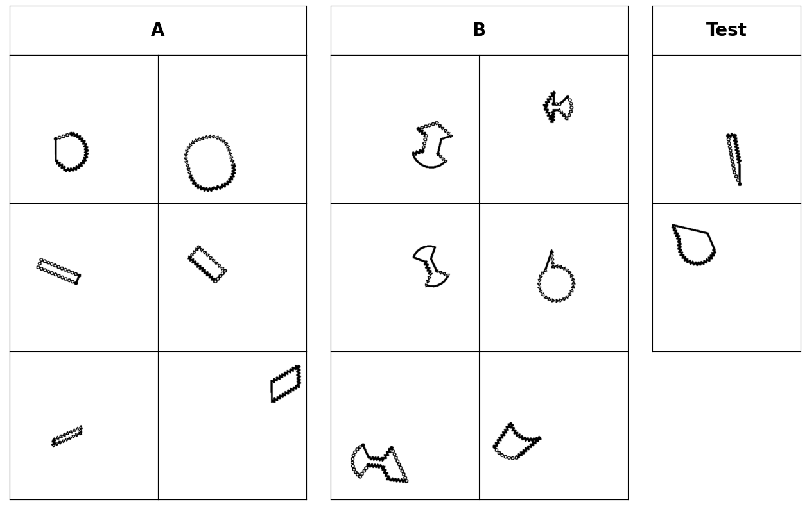

### Bongard Problem: Convex VS Concave


## Introduction

We have manually designed more than 600 shapes with different attributes for Bongard problem synthesis. This demon shows how to take advantage of the human designed shape information to generate Bongard problems. In particular, we created a "Convex VS Concave" Bongard problem as an example. 



Note that all the negative images does not necessarily have to form a concept. Instead, each of them violating the concept in positive images would be sufficient for a Bongard problem.


## Usages

To generate the Bongard demo images, please run the following command in the terminal.

```bash
python demo.py
```

This Python script will read the `human_designed_shapes.tsv` and `human_designed_shapes_attributes.tsv` provided by the Bongard library for sampling shapes and generate `OneStrokeShape`. The users could also design their own shapes and attributes and put them into the two `tsv` files.

The generated vector images would be saved in `demo/ps`, whereas the corresponding PNG images would be saved in `demo/png`. There is also a merged image from PNG images for human visualization in `demo`.


