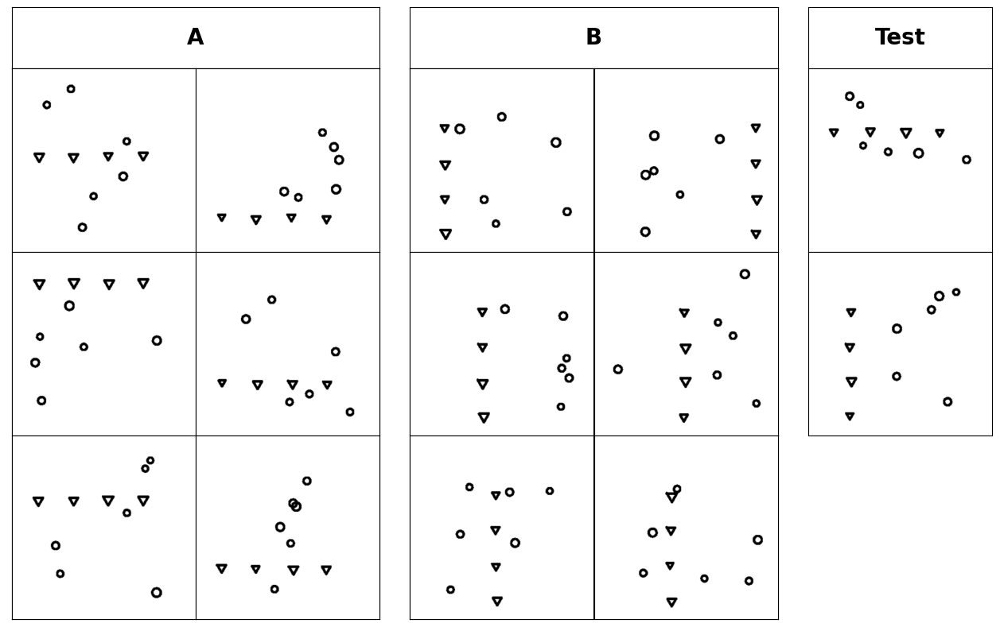

# Bongard Problem: Horizontal Alignment VS Vertical Alignment

## Introduction

This is a demo showing how to generate a Bongard problem that consists of seven positive images whose triangles are horizontally aligned and seven negative images whose triangles are vertically aligned. 



Note that all the negative images does not necessarily have to form a concept. Instead, each of them violating the concept in positive images would be sufficient for a Bongard problem.

## Usages

To generate the Bongard demo images, please run the following command in the terminal.

```bash
python demo.py
```

The generated vector images would be saved in `demo/ps`, whereas the corresponding PNG images would be saved in `demo/png`. There is also a merged image from PNG images for human visualization in `demo`.
